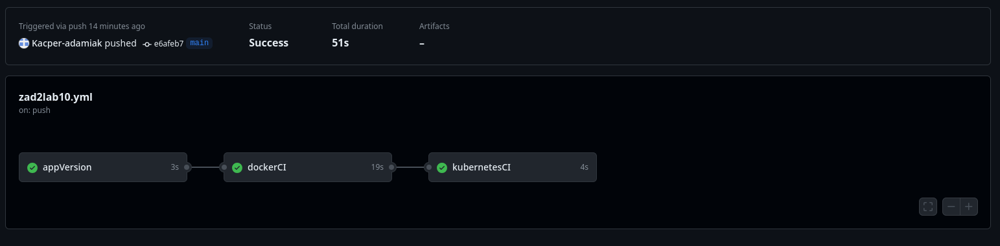

# Laboratorium 10

## Kacper Adamiak

## Użyte repozytoria

### Zadanie 1A

#### Zawartość pliku dockerfile

```dockerfile
FROM nginx:alpine 
WORKDIR /usr/share/nginx/html
COPY ./index.html .
EXPOSE 80
CMD ["nginx", "-g", "daemon off;"]
```

#### Zawartość pliku index.html

```html
<!DOCTYPE html>
<html lang="en">
<head>
    <meta charset="UTF-8">
    <meta name="viewport" content="width=device-width, initial-scale=1.0">
    <title>Laboratorium 10 zadanie 2</title>
</head>
<body style="width: 100%; height: 100vh;">
    <div style="height: 100%; display: flex; flex-direction: column; justify-content: center; align-items: center;">
        <h1>Laboratorium 10</h1>
        <h2>Zadanie 2</h2>
        <br>
        <br>
        <h3>Imie i nazwisko:</h3>
        <p>Kacper Adamiak</p>
        <h3>Wersja:</h3>
        <p>1.0.0</p>
        <h3>Dockerfile:</h3>
        <code>
            FROM nginx:alpine <br>
            WORKDIR /usr/share/nginx/html <br>
            COPY ./index.html . <br>
            EXPOSE 80 <br>
            CMD ["nginx", "-g", "daemon off;"] <br>
        </code>
    </div>
</body>
</html>
```

### Zadanie 1B

#### Zawartość pliku lab10_zad2_deployment.yaml

```yaml
apiVersion: apps/v1
kind: Deployment
metadata:
  name: lab10-deployment
spec:
  replicas: 4
  selector:
    matchLabels:
      app: lab10-app
  strategy:
    type: RollingUpdate
    rollingUpdate:
      maxSurge: 5
      maxUnavailable: 2
  template:
    metadata:
      labels:
        app: lab10-app
    spec:
      containers:
        - name: lab10-app
          image: kacperadamiak/lab10-zad2-app:1.0.2
```

#### Zawartość pliku lab10_zad2_service.yaml

```yaml
apiVersion: v1
kind: Service
metadata:
  name: lab10-service
spec:
  type: NodePort
  ports:
    - port: 8080
      targetPort: 80
      nodePort: 30000
  selector:
    app: lab10-app
```

#### Zawartość pliku lab10_zad2_ingress.yaml

```yaml
apiVersion: networking.k8s.io/v1
kind: Ingress
metadata:
  name: lab10-ingress
spec:
  rules:
  - host: zad2.lab
    http:
      paths:
      - pathType: Prefix
        path: "/"
        backend:
          service:
            name: lab10-service
            port:
              number: 8080
```

### Zadanie 2A / 2B

#### Zawartość pliku .github/workflow/lab10zad2.yaml

```yaml
name: Docker Image CI

on:
  workflow_dispatch:
  push:
    branches: [ "main" ]
  pull_request:
    branches: [ "main" ]

jobs:

  appVersion:
    runs-on: ubuntu-latest
    outputs:
      version_number: ${{ steps.vars.outputs.version_number }}
    steps:
    - name: Check out the repo
      uses: actions/checkout@v4
      
    - name: set-output
      id: vars
      run: |
        version_number=$(sed -n 's/.*<p>\(.*\)<\/p>.*/\1/p' index.html)
        echo "version_number=${version_number}" >> "$GITHUB_OUTPUT"
      shell: bash

        
  dockerCI:
    needs: appVersion
    runs-on: ubuntu-latest

    steps:
    - name: Check out the repo
      uses: actions/checkout@v4
    
    - name: Set up QEMU
      uses: docker/setup-qemu-action@v3
      
    - name: Set up Docker Buildx
      uses: docker/setup-buildx-action@v3
      
    - name: Login to Docker Hub
      uses: docker/login-action@v3
      with:
        username: ${{ secrets.DOCKER_HUB_LOGIN }}
        password: ${{ secrets.DOCKER_HUB_PASSWORD }}
    - name: Build and push
      uses: docker/build-push-action@v5
      with:
        context: .
        push: true
        tags: kacperadamiak/lab10-zad2-app:${{ needs.appVersion.outputs.version_number}}
        
  kubernetesCI:
    needs: [appVersion, dockerCI]
    runs-on: ubuntu-latest

    steps:
      - name: Check out the repo
        uses: actions/checkout@v4
        with:
          repository: Kacper-adamiak/lab10_zad2_config
          token: ${{ secrets.ACTIONS_TOKEN }}
      - run: |
          sed -i 's/kacperadamiak\/lab10-zad2-app:.*/kacperadamiak\/lab10-zad2-app:${{ needs.appVersion.outputs.version_number }}/g' lab10_zad2_deployment.yaml
          git config user.name github-actions
          git config user.email github-actions@github.com
          git add -u
          git commit -m "updated app version ${{ needs.appVersion.outputs.version_number }}"
          git push
```

### Zadanie 3A

#### Zawartość pliku gitops/dockerfile

```dockerfile
FROM alpine:latest

RUN apk update && \
    apk add --no-cache git curl && \
    apk add --no-cache --repository=http://dl-cdn.alpinelinux.org/alpine/edge/community kubectl

CMD ["/bin/sh"]
```

### Zadanie 3B

#### Zawartość pliku gitops/StepCD

```yaml
apiVersion: batch/v1
kind: CronJob
metadata:
  name: stepcd
spec:
  schedule: "*/2 * * * *"
  concurrencyPolicy: Forbid
  jobTemplate:
    spec:
      backoffLimit: 0
      template:
        spec:
          restartPolicy: Never
          serviceAccountName: gitops
          containers:
            - name: zad2gitops 
              image: kacperadamiak/lab10zad2gitops
              command: [sh, -e, -c]
              args:
                - git clone https://github.com/Kacper-adamiak/lab10_zad2_config /tmp/lab10_zad2_config && find /tmp/lab10_zad2_config -name '*.yaml' -exec kubectl apply -f {} \;
```

```bash
kubectl create sa gitops
kubectl create clusterrolebinding gitops-admin --clusterrole=cluster-admin --serviceaccount default:gitops
```

### Zadanie 4A / 4B

#### Uruchomienie StepCD

```bash
kubectl apply -f StepCD.yaml 
```


#### Wyświetlenie `get all` po uruchomieniu


#### Wyświetlenie curl

Działam na linuxie i po włączeniu tunelu w minikube nadal nie byłem w stanie normalnie się połączyć przez localhost, dlatego używam ip.


#### Wyświetlenie `get all` po kilku aktualizacjach


#### Wyświetlenie curl po aktualizacji


#### Wyświetlenie podsumowania github actions



