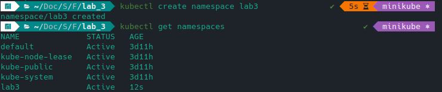
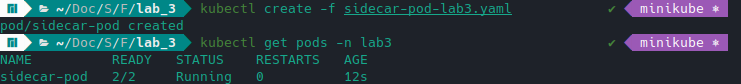
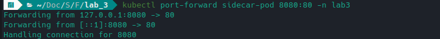
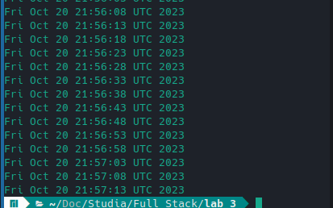

# Sprawozdanie nieobowiązkowe z laboratorium numer 3

Kacper Adamiak

https://github.com/Kacper-adamiak/full_stack_laboratory/tree/master/lab_3

### Zawartość pliku sidecar-pod-lab3.yaml

```yaml
apiVersion: v1
kind: Pod
metadata:
  name: sidecar-pod
  namespace: lab3
spec:
  containers:
  - name: busybox
    image: busybox
    command:
      - "sh"
      - "-c"
      - "while true; do date >> /var/log/date.log; sleep 5; done"
    volumeMounts:
    - name: shared-data
      mountPath: /var/log
  - name: nginx
    image: nginx
    volumeMounts:
    - name: shared-data
      mountPath: /usr/share/nginx/html
  volumes:
    - name: shared-data
      hostPath:
        path: /var/log
```

### Utworzenie przestrzeni nazw lab3



### Utworzenie wielokontenerowego pod-a o nazwie sidecar-pod w przestrzeni nazw lab3



### Wykonanie polecenia port forward w celu uzyskania dostępu z hosta



### Wykonanie polecenia curl celem podejrzenia pliku date.log

```bash
curl localhost:8080/date.log 
```

