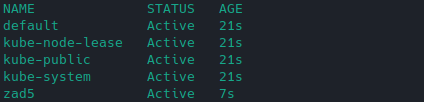
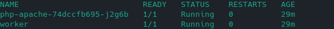
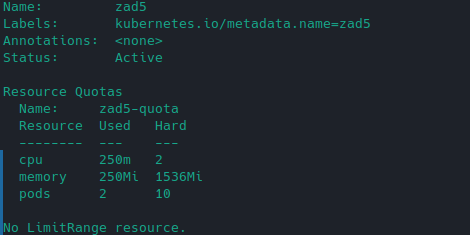
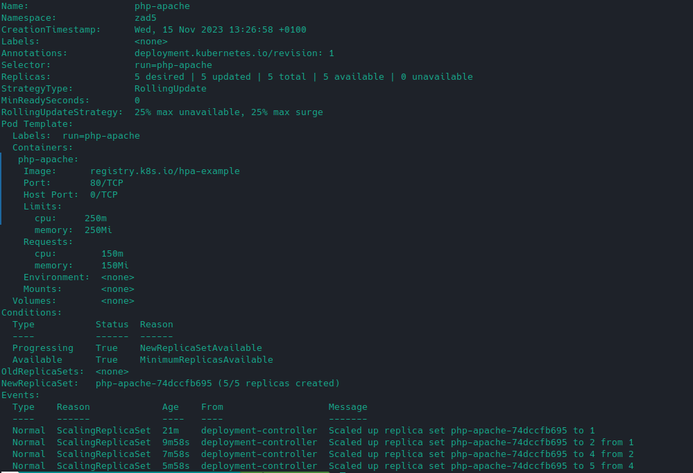
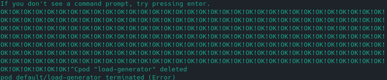
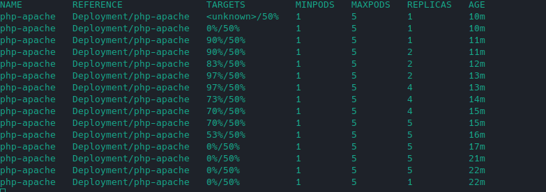
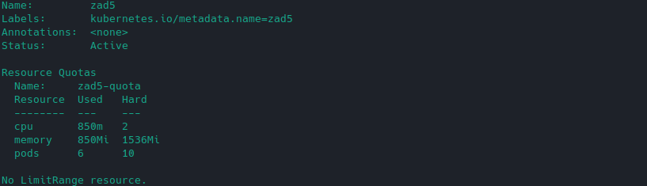

# Sprawozdanie nieobowiązkowe z laboratorium numer 5

Kacper Adamiak

https://github.com/Kacper-adamiak/full_stack_laboratory/tree/master/lab_5

## Zawartość pliku lab_5.yaml

```yaml
apiVersion: v1
kind: Namespace
metadata:
  name: zad5

---

apiVersion: v1
kind: ResourceQuota
metadata:
  name: zad5-quota
  namespace: zad5
spec:
  hard:
    pods: "10"
    cpu: "2000m"
    memory: 1.5Gi

---

apiVersion: v1
kind: Pod
metadata:
  name: worker
  namespace: zad5
spec:
  containers:
  - name: nginx-container
    image: nginx
    resources:
      limits:
        memory: 200Mi
        cpu: 200m
      requests:
        memory: 100Mi
        cpu: 100m

---

apiVersion: apps/v1
kind: Deployment
metadata:
  name: php-apache
  namespace: zad5
spec:
  selector:
    matchLabels:
      run: php-apache
  template:
    metadata:
      labels:
        run: php-apache
    spec:
      containers:
      - name: php-apache
        image: registry.k8s.io/hpa-example
        ports:
        - containerPort: 80
        resources:
          limits:
            memory: 250Mi
            cpu: 250m
          requests:
            memory: 150Mi
            cpu: 150m

---

apiVersion: v1
kind: Service
metadata:
  name: php-apache
  namespace: zad5
  labels:
    run: php-apache
spec:
  ports:
  - port: 80
  selector:
    run: php-apache

---

apiVersion: autoscaling/v2
kind: HorizontalPodAutoscaler
metadata:
  name: php-apache
  namespace: zad5
spec:
  scaleTargetRef:
    apiVersion: apps/v1
    kind: Deployment
    name: php-apache
  minReplicas: 1
  maxReplicas: 5
  metrics:
  - type: Resource
    resource:
      name: cpu
      target:
        type: Utilization
        averageUtilization: 50

```

## Uzasadnienie wybranych maxReplicas

Po sprawdzeniu zasobów potrzebnych do funkcjonowania poda workera, deploymen i zsumowaniu tych zasobów, wyszło mi że mogę ustawić maksymalną liczbę replik na 5. Jest to najwyższa liczba możliwa do ustawienia spełniająca warunki quoty przy najgorszym scenariuszu.

## Utworzenie elementów z zadania

```bash
kubectl create -f lab_5.yaml 
```



```bash
kubectl get pods -n zad5 
```



```bash
kubectl describe namespace zad5
```



```bash
kubectl describe deployments.apps php-apache -n zad5
```




## Użycie load-generatora

```bash
kubectl run -i --tty load-generator --rm --image=busybox:1.28 --restart=Never -- /bin/sh -c "while sleep 0.01; do wget -q -O- http://php-apache.lab5.svc.cluster.local; done"
```



## Sprawdzenie działania hpa

```bash
kubectl get hpa php-apache --watch -n zad5
```



```bash
kubectl describe namespace zad5
```



jak widać nie byłem w stanie wygenerować dostatecznego obciążenia by wykorzystać całe zasoby